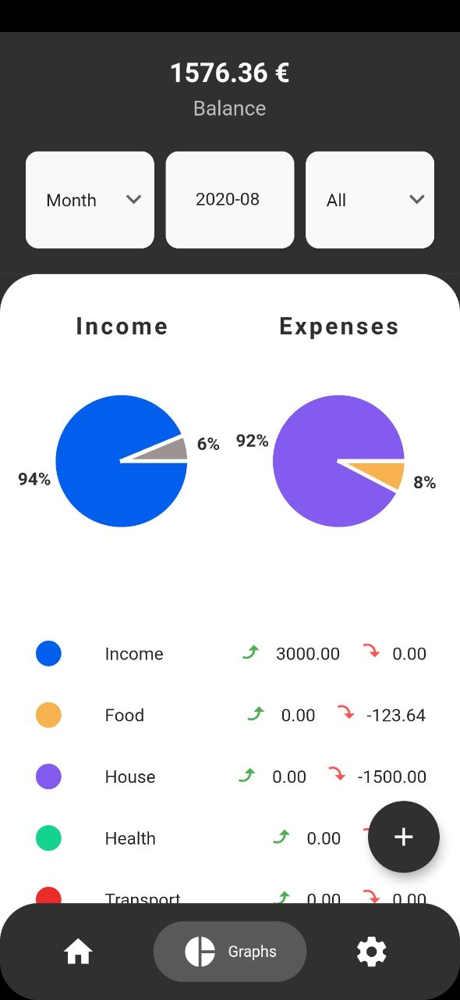

# Home Accountant

Home Accountant is a FOSS (Free Open-Source Software) built to manage bank accounts.

&nbsp;

# How it works

The application is built on multiple main pages:
1. The **Homepage** is where most information are displayed: total balance, expenses, income; transactions grouped by day, month or year
2. The **Graphs page** is where different pie charts are displayed. It gives info about the distribution of income and expenses by day, month or year; by categories.
3. The **Settings page** is where accounts and subcategories can be managed.

Home Accountant is organized in accounts. That is, you can build multiple accounts and save transactions independently from other accounts. The information on the homepage or graphs page are based on the selected account. It is also possible to selected a particular date range (day, month or year) in which the information showed will be based on the date range.
Multiple currencies are supported, when multiple accounts from different currencies are selected. The application uses a **main currency**, where all transactions amount will be displayed using an exchange rate towards the **main currency**. For these exchange rates, we are using [exchangerate.host](https://exchangerate.host/).

Home Accountant is built using [Flutter](https://flutter.dev/) and [Redux](https://pub.dev/packages/redux) as a state management tool. You can learn more about Redux [here](https://redux.js.org/).

# Roadmap

We are listing here all the improvements that are currently planned to be made for the application.

### High priority:
* Import/Export option
* Add the ability for a transaction to be recurrent
* Add transfers between accounts (automatically add expense for one, income for the other)

### Medium priority:
* Create a logo
* Add a toast on creation of an account, transaction or subcategory
* Support for different languages

### Low priority:
* Research bar in Categories
* Filter transactions by expense or not
* Clicking main cards in homepage navigates to graphs with eventual filters
* Add the ability to set a monthly budget amount for each category/subcategory
* Self-hosting option

# Issues

If you are from Github or Gitlab, please head to [Codeberg](https://codeberg.org/joristruong/homeaccountant-app) for creating issues. We are looking to centralize the issues.

# Dependencies

Home Accountant currently uses the following libraries:
* [sqflite](https://pub.dev/packages/sqflite)
* [redux](https://pub.dev/packages/redux)
* [flutter_redux](https://pub.dev/packages/flutter_redux)
* [fl_chart](https://pub.dev/packages/fl_chart)
* [keyboard_avoider](https://pub.dev/packages/keyboard_avoider)
* [flutter_iconpicker](https://pub.dev/packages/flutter_iconpicker)
* [flutter_date_pickers](https://pub.dev/packages/flutter_date_pickers)
* [date_util](https://pub.dev/packages/date_util)
* [flutter_svg](https://pub.dev/packages/flutter_svg)
* [url_launcher](https://pub.dev/packages/url_launcher)
* [persistent_bottom_nav_bar](https://pub.dev/packages/persistent_bottom_nav_bar)
* [google_fonts](https://pub.dev/packages/google_fonts)
* [flutter_pagewise](https://pub.dev/packages/flutter_pagewise)
* [expandable](https://pub.dev/packages/expandable)
* [flutter_icons](https://pub.dev/packages/flutter_icons)
* [currency_pickers](https://pub.dev/packages/currency_pickers)
* [fluttertoast](https://pub.dev/packages/fluttertoast)
* [redux_persist](https://pub.dev/packages/redux_persist)
* [redux_persist_flutter](https://pub.dev/packages/redux_persist_flutter)

# License

Home Accountant is a free open-source software released under the AGPL (Affero General Public License).

# Design

The design is heavily inspired from [Gullar Babakishiyeva](https://www.behance.net/gallery/98934611/Budget-Application-for-saving-money), with her permission. Make sure to check her socials !
* [Behance](https://www.behance.net/gullarbabakishiyeva)
* [Dribbble](https://dribbble.com/gullarbabakishiyeva)
* [LinkedIn](https://www.linkedin.com/in/gullarbabakishiyeva)
* [Instagram](https://www.instagram.com/gullarbabakishiyeva)
* [Pinterest](https://www.pinterest.com/gullarbabakishiyeva)
